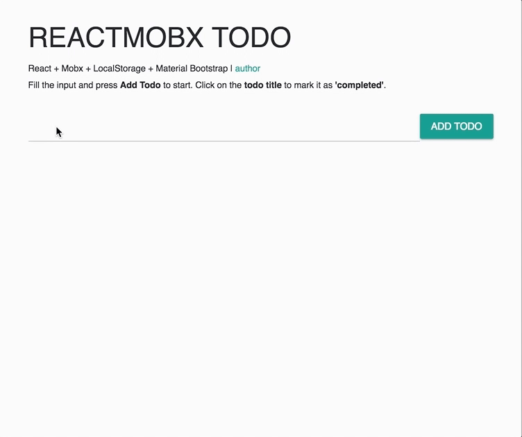

# REACTMOBX TODO

Live Demo: [http://todo-react-mobx.surge.sh/](http://todo-react-mobx.surge.sh/)

'REACTMOBX TODO' is just a simple todo app developed with [React](https://github.com/facebook/react/), [Mobxjs](https://github.com/mobxjs/mobx) and [Material Bootrap](https://fezvrasta.github.io/bootstrap-material-design/).  
The App use [Window.localStorage](https://developer.mozilla.org/en-US/docs/Web/API/Window/localStorage) to store his state and save the user data. Open the console to see Mobxjs in action.

## Install
Clone this repository and run `yarn` or `npm install`.

## Run the project
Run `yarn start` or `npm start` to start the project. Then open your browser at [http://localhost:3000](http://localhost:3000)

## Notes
This project was bootstrapped with [Create React App](https://github.com/facebookincubator/create-react-app).

